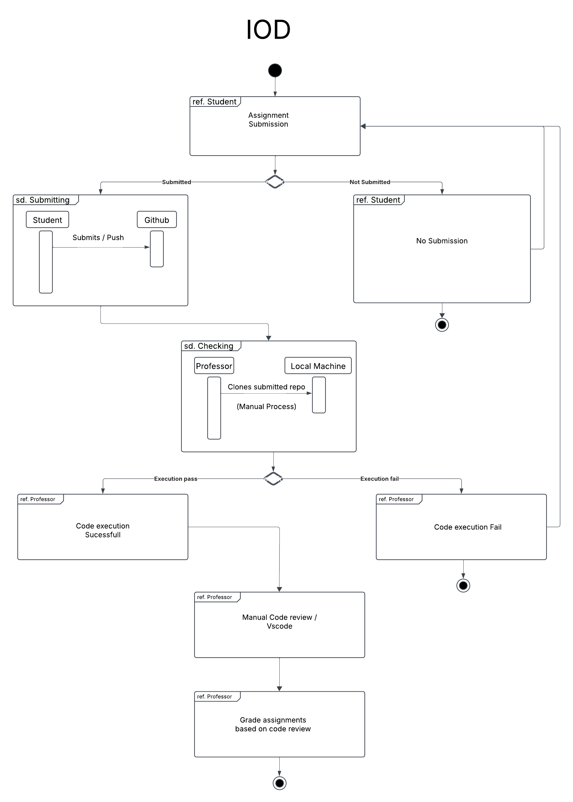
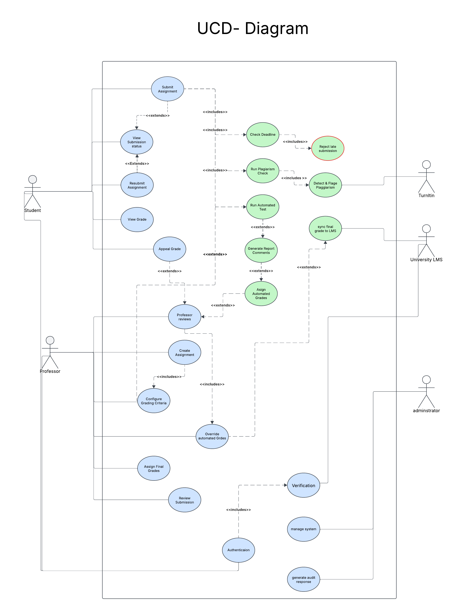
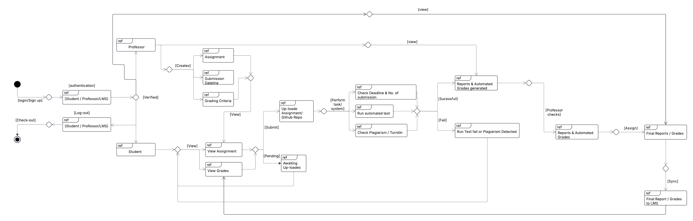

# Plagiarism Checker System — IOD & UCD Documentation

## Project Summary

This project presents the design and architecture of an automated plagiarism
checker and grading system for university programming assignments. The system
is modeled using two UML methodologies: Interaction Overview Diagrams (IoD)
and Use Case Diagrams (UCD), capturing the full lifecycle of assignment
submission, plagiarism detection, and grade management.

## Included Diagrams

### 1. IOD-For-Plagiarism-Checker.pdf
An Interaction Overview Diagram illustrating the end-to-end assignment
submission and evaluation workflow. This diagram captures both the manual
review process (professor cloning and inspecting code in VSCode) and the
automated checking pipeline, showing how control flows between actors across
the full grading lifecycle.

### 3. UCD-Plagiarism-Checker.pdf
A Use Case Diagram for the programming assignment management system. This
document defines the responsibilities of each actor — Student, Professor, and
the Learning Management System (LMS) — and maps them to system features
including assignment submission, plagiarism checking, grade overrides, and
LMS synchronisation.

### 2. Plagiarism-Checker-IOD-UCD-Combined-Final.pdf
A combined document presenting both the IoD and UCD together as an integrated
view of the system. It traces the complete flow from assignment submission
through automated testing, plagiarism detection via TurnItIn, and the
generation of automated grades and reports — showing how all components
connect into a single coherent system.

---

## Core System Features

**Automated Testing**
Submitted code is automatically executed against a predefined test suite.
Results feed directly into the grading pipeline, reducing manual effort and
ensuring consistent evaluation against assignment requirements.

**Plagiarism Detection**
The system performs a two-stage plagiarism check: first by comparing
submissions against each other (peer-to-peer), then by submitting code to
TurnItIn for external verification. Results are returned to the professor
before any grade is finalised.

**Flexible Grading System**
Grades are calculated automatically from test results, but professors retain
full authority to review and override the automated grade. This ensures
academic judgement is always in the loop.

**LMS Integration**
Once a grade is approved, it is automatically exported to the university's
Learning Management System (LMS). All records are stored with a full audit
trail to support the annual regulatory review by the state-based body.

---

## How to Use These Diagrams

1. Start with the **UCD** to understand which actors exist and what the system
   must support at a functional level.
2. Move to the **IoD (Actor-to-Actor)** to see how actors interact with each
   other to achieve the business outcome, independent of the system.
3. Finally, read the **Combined IoD + UCD** document to see how the system
   mediates those interactions — showing the full picture of actors, system
   steps, decision points, and parallel processes working together.